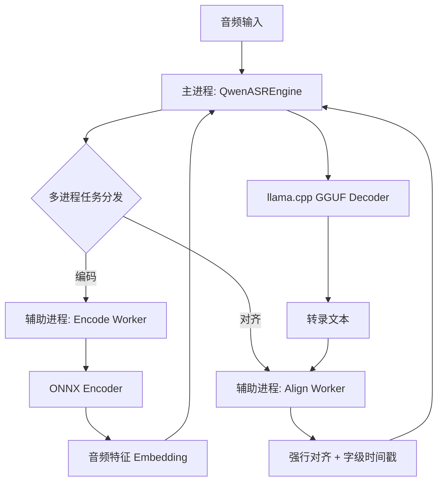

# Qwen3-ASR GGUF

将 [Qwen3-ASR](https://www.modelscope.cn/collections/Qwen/Qwen3-ASR) 模型转换为可本地高效运行的混合格式，实现**快速、准确的离线语音识别**。

主要依赖 [llama.cpp](https://github.com/ggml-org/llama.cpp) 加速 LLM Decoder。

Qwen3-ASR 0.6B 与 Qwen3-ASR 1.7B 以及 Qwen3-ForceAligner 0.6B 均可用，

实测，在开启 DML 时，Encoder 用 fp16 格式，Decoder 用 q8_0 格式，0.6B 的 ASR 模型约占 3G 内存，0.6B 的 Aligner 模型约占 3G 显存。

### 核心特性

- ✅ **纯本地运行** - 无需网络，数据不外传
- ✅ **速度快** - 混合推理架构 (ONNX Encoder + GGUF Decoder)
- ✅ **GPU 加速** - 支持 Vulkan / DirectML 
- ✅ **流式输出** - 无限时长的音频文件，流式转录
- ✅ **字幕输出** - ForceAligner 对齐字级时间戳，输出 SRT/JSON 格式
- ✅ **上下文增强** - 可提供上下文信息，提升准确率

## 性能表现

1.7B 在 RTX 5050 笔记本上的实测数据（40秒中文音频）：

```
--- [QwenASR] 初始化引擎 (DML: True) ---
--- [QwenASR] 辅助进程已就绪 ---
大家好，
二零二六年一月十一日星期日，
欢迎收看一千零四期睡前消息，
请静静介绍话题。
去年十月十九日，
九百六十七期节目说到委内瑞拉问题，
我们回顾一下你当时的评论。
无论是从集结的兵力来看，
还是从动机来看，
特朗普政府并不打算对委内瑞拉政权发动全面的进攻，
最多是发动象征性的轰炸进行政治投机。
在诺贝尔和平奖发给了委内瑞拉反对派之后，
美国军队进攻的概率进一步降低。
现在美国突袭委内瑞拉，
抓走了总统马杜罗。
督工你怎么看待两个月之前的判断？
当初的判断不变，


📊 性能统计:
  🔹 RTF (实时率) : 0.033 (越小越快)
  🔹 音频时长    : 40.00 秒
  🔹 总处理耗时  : 1.31 秒
  🔹 编码等待    : 0.17 秒
  🔹 对齐总时    : 0.32 秒 (分段异步对齐)
  🔹 LLM 预填充  : 0.060 秒 (554 tokens, 9273.0 tokens/s)
  🔹 LLM 生成    : 0.701 秒 (142 tokens, 202.6 tokens/s)
✅ 已保存文本文件: 睡前消息.txt
✅ 已生成字幕文件: 睡前消息.srt
✅ 已导出时间戳: 睡前消息.json

=============== 对齐结果预览 (前10个) ===============
大          |   8.160s |   8.320s
家          |   8.320s |   8.400s
好          |   8.400s |   8.720s
，          |   8.720s |   8.720s
二          |   8.720s |   8.880s
零          |   8.880s |   8.960s
二          |   8.960s |   9.040s
六          |   9.040s |   9.200s
年          |   9.200s |   9.360s
一          |   9.360s |   9.440s
====================================================
```


## 快速开始

### 1. 安装依赖

```bash
pip install onnxruntime-directml pydub numpy gguf 
```

转换格式还需要：

```bash
pip install torch transformers==4.57.6
```

> `pydub` 需要系统安装 [ffmpeg](https://ffmpeg.org/download.html)
> 
> 依赖可能写得不是那么全，缺啥就装啥呗，没有需要自己编译的

从 [llama.cpp Releases](https://github.com/ggml-org/llama.cpp/releases) 下载预编译二进制，将 DLL 放入 `qwen_asr_gguf/bin/`：

| 平台 | 下载文件 |
|------|----------|
| **Windows** | `llama-bXXXX-bin-win-vulkan-x64.zip` |

### 2. 下载并导出模型

下载原始模型：

```bash
pip install modelscope
modelscope download --model Qwen/Qwen3-ASR-0.6B
modelscope download --model Qwen/Qwen3-ForcedAligner-0.6B
```

配置 `export_config.py`，定义官方模型路径、导出路径：

```python
from pathlib import Path
model_home = Path('~/.cache/modelscope/hub/models/Qwen').expanduser()

# [源模型路径] 官方下载好的 SafeTensors 模型文件夹
ASR_MODEL_DIR =  model_home / 'Qwen3-ASR-0.6B'
ALIGNER_MODEL_DIR =  model_home / 'Qwen3-ForcedAligner-0.6B'

# [导出目标路径] 转换后的 ONNX, GGUF 和权重汇总目录
EXPORT_DIR = r'./model'

```

导出模型：

```bash
# 阶段一：导出 Encoder
python 01-Export-Mel-Filters.py       # Mel 滤波器权重
python 02-Export-ASR-Encoder-ONNX.py  # ASR Encoder 导出为 onnx 格式
python 03-Quantize-ASR-Encoder.py     # ASR Encoder 量化为 FP16/INT8
python 04-Export-ASR-Decoder-HF.py    # ASR Decoder 导出为 HF 格式
python 05-Convert-ASR-Decoder-GGUF.py # ASR Decoder 转为 GGUF 格式

python 12-Export-Aligner-Encoder-ONNX.py  # ForceAligner Encoder 导出为 onnx 格式
python 13-Quantize-Aligner-Encoder.py     # ForceAligner Encoder 量化为 FP16/INT8
python 14-Export-Aligner-Decoder-HF.py    # ForceAligner Decoder 导出为 HF 格式
python 15-Convert-Aligner-Decoder-GGUF.py # ForceAligner Decoder 转为 GGUF 格式

```

### 3. 转录测试

打开 `21-Run-ASR.py` 修改里面的音频文件路径，然后直接运行即可：

```bash
python 21-Run-ASR.py
```

部分代码解析：

```python
# 配置引擎
config = ASREngineConfig(
    model_dir="model", 
    use_dml = True, 
    encoder_fn = "qwen3_asr_encoder.fp16.onnx" ,
    enable_aligner = True, 
    align_config = AlignerConfig(
        use_dml=True, 
        model_dir="model", 
        encoder_fn = "qwen3_aligner_encoder.fp16.onnx" 
    )
)

# 初始化引擎
engine = QwenASREngine(config=config)

# 执行转录
res = engine.transcribe(
    audio_file=audio_path,  
    context=context,
    language="Chinese",   # 强制指定语言 (如 'Chinese', 'English', None)
    chunk_size=40.0,      # 每一片段的时长
    memory_num=1,         # 记忆多少片段
    start_second=0,       # 从何处开始读音频
    duration=None         # 读取多长音频，None 表示全部读取
)

```

## 工作原理

项目采用 **主进程控制 + 辅助进程计算** 的并行架构，最大化利用 CPU/GPU 资源：



- **主进程**: 负责音频切割、ASR LLM 解码。
- **辅助进程**: 音频特征提取（Encoder）、字级时间戳对齐（Aligner），与主进程异步并行，消除计算瓶颈。


## 项目结构

```bash
├── 01-Export-Mel-Filters.py        # 导出音频预处理权重
├── 02-Export-ASR-Encoder-ONNX.py   # 导出 ASR 编码器 (ONNX)
├── 03-Quantize-ASR-Encoder.py      # ASR 编码器量化 (INT8/FP16)
├── 04-Export-ASR-Decoder-HF.py     # ASR 解码器权重提取 (HF)
├── 05-Convert-ASR-Decoder-GGUF.py  # ASR 解码器转为 GGUF 格式
├── 12-Export-Aligner-Encoder-ONNX.py # 导出对齐编码器
├── 13-Quantize-Aligner-Encoder.py  # 对齐编码器量化
├── 21-Run-ASR.py                   # 完整转录示例脚本（主程序）
└── qwen_asr_gguf/
    └── inference/
        ├── asr.py                  # ASR 核心引擎逻辑
        ├── asr_worker.py           # 异步辅助进程逻辑
        ├── aligner.py              # 强行对齐逻辑
        ├── encoder.py              # 音频特征提取逻辑
        ├── llama.py                # llama.cpp Python 绑定
        ├── exporters.py            # SRT/JSON/TXT 导出工具
        └── chinese_itn.py          # 中文数字规整
```

## 常见问题

**Q: 输出全是乱码或「!!!!」怎么办？**

Intel 集显的 FP16 计算可能溢出，设置环境变量禁用：

```python
os.environ["GGML_VK_DISABLE_F16"] = "1"
```


---

## 致谢

- [Qwen3-ASR](https://www.modelscope.cn/collections/Qwen/Qwen3-ASR) - 原始模型
- [llama.cpp](https://github.com/ggml-org/llama.cpp) - GGUF 推理引擎
