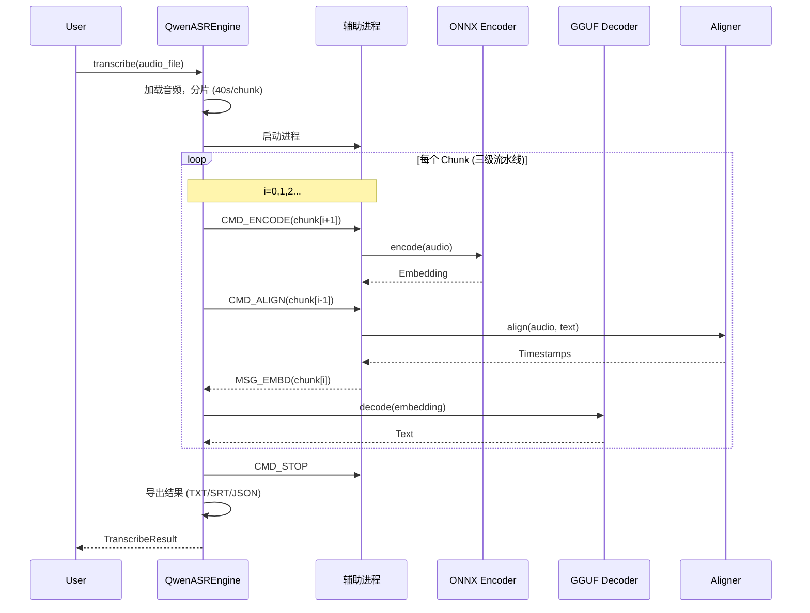

# Qwen3-ASR-GGUF 项目架构文档

> 文档版本：1.0  
> 最后更新：2026-02-23  
> **推荐阅读顺序：第 ① 顺位**（项目入门首选）

---

## 📋 本文档阅读指南

### 在完整项目文档中的阅读顺序

| 顺位 | 文档 | 文件名 | 目标读者 | 预计耗时 |
|:----:|------|--------|----------|----------|
| **①** | **项目架构** | `ARCHITECTURE.md` | 想了解项目整体设计 | 1-2 小时 |
| **②** | [集成指南](./INTEGRATION.md) | `INTEGRATION.md` | 想快速使用项目 | 1-2 小时 |
| **③** | [学习计划](./LEARNING_PLAN.md) | `LEARNING_PLAN.md` | 想深入理解原理 | 4-12 周 |
| **④** | [导出指南](./EXPORT_GUIDE.md) | `EXPORT_GUIDE.md` | 想转换自己的模型 | 2-4 小时 |
| **⑤** | [源码解析](./SOURCE_CODE.md) | `SOURCE_CODE.md` | 想修改/扩展功能 | 4-8 周 |

### 本文档结构

```
阅读建议：按顺序阅读，或跳转到感兴趣的部分

1. 项目概述         ──────▶ 了解项目定位和性能指标
2. 系统架构总览     ──────▶ 理解整体设计和进程架构
3. 核心模块详解     ──────▶ 深入各大模块的工作原理
4. 数据流与工作流程 ──────▶ 理解数据如何流动和处理
5. 模型导出流程     ──────▶ 了解模型如何转换
6. 技术亮点与优化   ──────▶ 学习性能优化技术
7. 快速参考         ──────▶ API 和命令行速查
```

---

## 目录

1. [项目概述](#1-项目概述)
2. [系统架构总览](#2-系统架构总览)
3. [核心模块详解](#3-核心模块详解)
4. [数据流与工作流程](#4-数据流与工作流程)
5. [模型导出流程](#5-模型导出流程)
6. [技术亮点与优化](#6-技术亮点与优化)
7. [快速参考](#7-快速参考)

---

## 1. 项目概述

### 1.1 项目定位

本项目将 **Qwen3-ASR 语音识别模型** 转换为可本地高效运行的混合格式，实现**快速、准确的离线语音识别**。

核心设计理念：
- **混合推理架构**：ONNX (Encoder) + GGUF (Decoder)
- **多进程并行**：编码、对齐与解码异步执行
- **量化优化**：INT4 Encoder + Q4_K GGUF，最小化显存占用

### 1.2 支持的模型

| 模型 | 参数量 | 用途 |
|------|--------|------|
| Qwen3-ASR-0.6B | 0.6B | 轻量级语音识别 |
| Qwen3-ASR-1.7B | 1.7B | 高精度语音识别 |
| Qwen3-ForcedAligner-0.6B | 0.6B | 字级时间戳对齐 |

### 1.3 性能指标

以 1.7B 模型在 RTX 5050 笔记本上为例（50 秒中文音频）：

| 指标 | GPU (DML) | CPU |
|------|-----------|-----|
| RTF (实时率) | 0.052 | 0.390 |
| 总处理耗时 | 2.59 秒 | 19.60 秒 |
| LLM 预填充速度 | 4149 tokens/s | 162 tokens/s |
| LLM 生成速度 | 114 tokens/s | 27 tokens/s |
| 显存占用 | ~900MB | N/A |

---

## 2. 系统架构总览

### 2.1 进程架构

```
┌─────────────────────────────────────────────────────────────────┐
│                        主进程 (Main Process)                     │
│  ┌─────────────────────────────────────────────────────────┐    │
│  │                   QwenASREngine                          │    │
│  │  ┌──────────────┐  ┌──────────────┐  ┌───────────────┐  │    │
│  │  │ 音频预处理   │  │ ASR Decoder  │  │ 结果导出器    │  │    │
│  │  │ (切片/记忆)  │──▶│ (GGUF/LLM)   │──▶│ (TXT/SRT/JSON)│  │    │
│  │  └──────────────┘  └──────────────┘  └───────────────┘  │    │
│  └─────────────────────────────────────────────────────────┘    │
│         │                        │                              │
│         │ Queue (to_worker_q)    │ Queue (from_enc_q)          │
│         ▼                        ▼                              │
└─────────────────────────────────────────────────────────────────┘
         │                        │
         │                        │ Queue (from_align_q)
         ▼                        ▼
┌─────────────────────────────────────────────────────────────────┐
│                    辅助进程 (Worker Process)                     │
│  ┌──────────────────┐    ┌──────────────────┐                  │
│  │  QwenAudioEncoder│    │ QwenForcedAligner│                  │
│  │  (ONNX Runtime)  │    │   (GGUF/LLM)     │                  │
│  │  ┌────────────┐  │    │  ┌────────────┐  │                  │
│  │  │ Frontend   │  │    │  │  Encoder   │  │                  │
│  │  │ (CNN)      │  │    │  │  (ONNX)    │  │                  │
│  │  ├────────────┤  │    │  ├────────────┤  │                  │
│  │  │ Backend    │  │    │  │  Decoder   │  │                  │
│  │  │ (Transformer)│  │  │  │  (GGUF)    │  │                  │
│  │  └────────────┘  │    │  └────────────┘  │                  │
│  └──────────────────┘    └──────────────────┘                  │
│         │                        │                              │
│         │ 返回 Embedding         │ 返回对齐结果                  │
└─────────────────────────────────────────────────────────────────┘
```

### 2.2 模块依赖关系

```
transcribe.py (用户入口)
    │
    ▼
qwen_asr_gguf/inference/
├── asr.py              # 核心引擎 (QwenASREngine)
│   ├── encoder.py      # 音频编码 (ONNX)
│   ├── aligner.py      # 时间戳对齐 (GGUF)
│   ├── llama.py        # llama.cpp 绑定
│   ├── asr_worker.py   # 辅助进程逻辑
│   ├── schema.py       # 数据结构定义
│   ├── exporters.py    # 结果导出 (SRT/JSON/TXT)
│   ├── chinese_itn.py  # 中文数字规整
│   └── utils.py        # 工具函数
│
qwen_asr_gguf/export/   # 模型导出工具
├── convert_hf_to_gguf.py
├── gguf/
└── qwen3_asr_custom/
```

### 2.3 技术栈

| 组件 | 技术 | 用途 |
|------|------|------|
| **Encoder** | ONNX Runtime | 音频特征提取，支持 DML/Vulkan |
| **Decoder** | llama.cpp | LLM 推理，支持 GGUF 量化格式 |
| **音频处理** | NumPy + SciPy | Mel 频谱计算 |
| **命令行** | Typer + Rich | CLI 交互界面 |
| **打包** | PyInstaller | 单文件可执行分发 |

---

## 3. 核心模块详解

### 3.1 QwenASREngine (asr.py)

**职责**：流式转录引擎，协调编码、解码、对齐三大任务。

#### 核心方法

```python
class QwenASREngine:
    def __init__(self, config: ASREngineConfig):
        """初始化引擎，启动辅助进程，加载 LLM"""
        
    def transcribe(audio_file, language, context, ...) -> TranscribeResult:
        """从文件加载音频并执行完整转录"""
        
    def asr(audio, chunk_size_sec, memory_chunks, ...) -> TranscribeResult:
        """核心转录流水线 (三级流水线)"""
```

#### 三级流水线设计

主循环采用 **i+1 预取、i 识别、i-1 对齐** 的三级流水线：

```
时间线 ──────────────────────────────────────────────▶

Chunk 0:  [编码 0] ──▶ [识别 0] ──▶ [对齐 0]
                        │
Chunk 1:                 [编码 1] ──▶ [识别 1] ──▶ [对齐 1]
                                      │
Chunk 2:                               [编码 2] ──▶ [识别 2] ──▶ [对齐 2]
```

#### 记忆管理机制

```python
asr_memory = deque(maxlen=memory_chunks)  # 默认保留 1 个历史片段

# 每个片段识别时，将历史片段的 embedding 和文本拼接为上下文
prefix_text = "".join([m[1] for m in asr_memory])  # 历史文本
combined_audio = np.concatenate([m[0] for m in asr_memory] + [audio_feature])
```

#### Prompt 构建策略

```python
def _build_prompt_embd(audio_embd, prefix_text, context, language):
    """
    构造 LLM 输入的 Embedding 序列：
    
    [IM_START] System [IM_END] [IM_START] User [AUDIO_START]
    └─────────────┘              └────────────┘
         Block A                    Block A
    
    [Audio Embedding] [AUDIO_END] [IM_END] [IM_START] Assistant [LANG] [ASR_TEXT] [Prefix]
    └────────────────┘            └──────────────────────────────────────────────┘
         Block B                              Block C
    """
```

### 3.2 QwenAudioEncoder (encoder.py)

**职责**：音频 → Mel 频谱 → 音频特征 Embedding

#### 架构设计

```
音频输入 (16kHz, float32)
    │
    ▼
FastWhisperMel  ───────────────┐
  ├─ 分帧 (Hann 窗)             │
  ├─ FFT (实数)                 │ 128 维 Mel 频谱
  ├─ Mel 滤波                   │ (128, T)
  └─ 对数归一化                 │
    │                          │
    ▼                          ▼
QwenAudioEncoder (Split 模式)
    │
    ├─ Frontend (CNN) ────────▶ 分片推理 (100 帧/片)
    │   ├─ Mel 分块             │
    │   ├─ CNN 特征提取          │
    │   └─ 拼接 + 切片           │
    │                          │
    ▼                          │
Backend (Transformer) ◀───────┘
  ├─ Attention Mask (全 0)
  └─ Transformer 编码
    │
    ▼
音频 Embedding (T, 896/1024)
```

#### 关键技术点

1. **Split ONNX 设计**：
   - Frontend：处理 100 帧分片，输出 13 帧特征
   - Backend：处理完整序列，输出最终 Embedding
   - 优势：避免长序列 Attention 的 O(n²) 内存开销

2. **长度计算**：
   ```python
   def get_feat_extract_output_lengths(input_lengths):
       input_lengths_leave = input_lengths % 100
       feat_lengths = (input_lengths_leave - 1) // 2 + 1
       output_lengths = ((feat_lengths - 1) // 2 + 1 - 1) // 2 + 1 + (input_lengths // 100) * 13
       return int(output_lengths)
   ```

3. **Mel 提取优化**：
   - 使用 `np.lib.stride_tricks.as_strided` 零拷贝分帧
   - 预计算 Hann 窗和 Mel 滤波器组
   - 无 librosa 依赖，消除 Numba JIT 启动延时

### 3.3 QwenForcedAligner (aligner.py)

**职责**：音频 + 文本 → 字级时间戳

#### 对齐原理

```
输入：音频 Embedding + 文本 "你好世界"
    │
    ▼
分词：["你", "好", "世", "界"]
    │
    ▼
构建 Prompt:
[<|audio_start|>] [Audio Embedding] [<|audio_end|>]
[你] [<TS1>] [<TS2>] [好] [<TS3>] [<TS4>] [世] [<TS5>] [<TS6>] [界] [<TS7>] [<TS8>]
    │
    ▼
LLM 推理 (仅计算 <TS> 位置的 Logits)
    │
    ▼
解析 Timestamp Token → 毫秒值 (step=80ms)
    │
    ▼
后处理：
  ├─ fix_timestamps()  ──▶ 单调递增修正 (LIS 算法)
  └─ reconcile()         ──▶ 标点符号回填
    │
    ▼
输出：ForcedAlignItem 列表
```

#### 时间戳修正算法

```python
def fix_timestamps(data: np.ndarray) -> List[int]:
    """
    使用 LIS (最长递增子序列) 检测异常时间点：
    1. 找出最长的单调递增子序列
    2. 标记非递增点为异常
    3. 根据异常数量采用不同插值策略：
       - ≤2 个：就近填充
       - >2 个：线性插值
    """
```

#### 多语言分词支持

| 语言 | 分词策略 |
|------|----------|
| 中文 | 逐字拆分 (CJK 字符) |
| 英文 | 按空格分词 |
| 日文 | nagisa 分词库 |
| 韩文 | soynlp 分词库 |

### 3.4 Llama 绑定 (llama.py)

**职责**：封装 llama.cpp C API，提供 Python 接口

#### 核心类

```python
class LlamaModel:
    """GGUF 模型封装"""
    def __init__(self, path):
        self.ptr = load_model(path)
        self.n_embd = ...
        self.eos_token = ...
    
    def tokenize(text) -> List[int]
    def detokenize(tokens) -> str
    def token_to_id(text) -> int

class LlamaContext:
    """推理上下文"""
    def __init__(self, model, n_ctx, n_batch, ...)
    def decode(batch)
    def clear_kv_cache()
    def get_logits_ith(i)

class LlamaBatch:
    """批处理封装"""
    def set_embd(data, pos, seq_id)
    # 支持 Embedding 直接注入和复杂位置编码

class LlamaSampler:
    """采样器链"""
    def __init__(self, temperature, top_k, top_p, seed)
    def sample(ctx) -> token
```

#### 量化格式支持

| 格式 | 说明 | 精度损失 |
|------|------|----------|
| F32 | 原始精度 | 0% |
| F16 | 半精度 | ~0.1% |
| Q4_K | 4-bit 量化 (K-quants) | ~0.5% |
| Q8_0 | 8-bit 量化 | ~0.2% |

### 3.5 辅助进程 (asr_worker.py)

**职责**：在独立进程中执行编码和对齐任务，避免 GIL 限制

#### 通信协议

```python
class MsgType(Enum):
    CMD_ENCODE = auto()   # 主进程 → Worker: 编码请求
    CMD_ALIGN = auto()    # 主进程 → Worker: 对齐请求
    CMD_STOP = auto()     # 主进程 → Worker: 停止
    MSG_EMBD = auto()     # Worker → 主进程：返回 Embedding
    MSG_ALIGN = auto()    # Worker → 主进程：返回对齐结果
    MSG_READY = auto()    # Worker → 主进程：就绪信号
    MSG_ERROR = auto()    # Worker → 主进程：错误信号
```

#### 进程拓扑

```
主进程                          辅助进程
  │                              │
  ├── to_worker_q ──────────────▶│
  │                              │ 接收任务
  │                              ├─ do_encode_task()
  │                              └─ do_align_task()
  │                              │
  │◀────── from_enc_q ───────────┤ 返回 Embedding
  │                              │
  │◀───── from_align_q ──────────┤ 返回对齐结果
```

---

## 4. 数据流与工作流程

### 4.1 完整转录流程



### 4.2 音频切片策略

```
原始音频 (50 秒)
    │
    ▼
┌─────────┬─────────┬─────────┬─────────┐
│ Chunk 0 │ Chunk 1 │ Chunk 2 │ Chunk 3 │
│  0-40s  │ 40-50s  │         │         │
└─────────┴─────────┴─────────┴─────────┘
    │         │         │         │
    │         │         │         │ 记忆：[Chunk 2 text]
    │         │         │ 识别：[Chunk 2 + memory]
    │         │ 对齐：Chunk 0
    │ 识别：[Chunk 1 + memory]
    记忆：[Chunk 0 text]
```

### 4.3 记忆上下文机制

```python
# 默认配置
chunk_size = 40.0   # 每片 40 秒
memory_num = 1      # 记忆 1 个历史片段

# 识别 Chunk 1 时的输入构成
prefix_text = "Chunk 0 的转录文本"
audio_embd = concat([Chunk_0_embedding, Chunk_1_embedding])

# LLM Prompt 结构
system: "You are a helpful assistant."
user: "<|audio_start|> [Chunk0+1 Audio] <|audio_end|>"
assistant: "language Chinese<asr_text> Chunk0 文本"
```

---

## 5. 模型导出流程

### 5.1 ASR 模型导出

```bash
# === 阶段 1: Encoder 导出 ===
python 01-Export-ASR-Encoder-Frontend.py     # 导出 CNN 前端
python 02-Export_ASR-Encoder-Backend.py      # 导出 Transformer 后端
python 03-Optimize-ASR-Encoder.py            # ONNX 优化 (常量折叠、算子融合)
python 04-Quantize-ASR-Encoder.py            # 量化 (FP16/INT8/INT4)

# === 阶段 2: Decoder 导出 ===
python 05-Export-ASR-Decoder-HF.py           # 提取 HuggingFace 权重
python 06-Convert-ASR-Decoder-GGUF.py        # 转为 GGUF (FP16)
python 07-Quantize-ASR-Decoder-GGUF.py       # GGUF 量化 (Q4_K)
```

### 5.2 Aligner 模型导出

```bash
# 流程与 ASR 相同，脚本编号 11-17
python 11-Export-Aligner-Encoder-Frontend.py
python 12-Export-Aligner-Encoder-Backend.py
python 13-Optimize-Aligner-Encoder.py
python 14-Quantize-Aligner-Encoder.py
python 15-Export-Aligner-Decoder-HF.py
python 16-Convert-Aligner-Decoder-GGUF.py
python 17-Quantize-Aligner-Decoder-GGUF.py
```

### 5.3 量化精度对比

| 组件 | 量化方案 | 相似度/困惑度 | 显存占用 |
|------|----------|---------------|----------|
| Encoder | INT4 | 余弦相似度 96% | 473MB |
| Decoder | Q4_K | 困惑度 +8.7% | 1064MB |

---

## 6. 技术亮点与优化

### 6.1 性能优化

| 优化点 | 技术 | 效果 |
|--------|------|------|
| **多进程并行** | 编码、对齐与解码异步 | 消除计算瓶颈 |
| **Split ONNX** | Encoder 分前后端 | 降低长序列内存 |
| **Mel 提取优化** | NumPy 视图零拷贝 | 消除 librosa 延迟 |
| **Logits 稀疏计算** | 仅计算 TS 位置 | 对齐提速 2x |
| **记忆上下文** | 历史片段拼接 | 提升转录连贯性 |

### 6.2 精度保障

| 技术 | 说明 |
|------|------|
| **K-quants 量化** | GGUF Q4_K，精度损失最小化 |
| **时间戳修正** | LIS 单调性检测 + 线性插值 |
| **标点回填** | Reconcile 算法恢复原始标点 |
| **ITN 处理** | 中文数字规整 (一→1) |

### 6.3 跨平台支持

| 平台 | GPU 加速 | 备注 |
|------|----------|------|
| Windows | DirectML / Vulkan | DML 显存占用更低 |
| macOS | Metal | 通过 llama.cpp |
| Linux | Vulkan / CUDA | 需编译 llama.cpp |

### 6.4 异常处理

```python
# 解码熔断机制
if len(stable_tokens) > 15:
    if len(set(stable_tokens[-15:])) <= 3:
        result.is_aborted = True  # 检测到重复循环

# 温度加温重试
for i in range(4):
    res = decode(temperature)
    if not res.is_aborted: break
    temperature += 0.3  # 逐步提高温度
```

---

## 7. 快速参考

### 7.1 目录结构

```
Qwen3-ASR-GGUF/
├── transcribe.py                    # 命令行工具 (主入口)
├── 21-Run-ASR.py                    # ASR API 示例
├── 18-Run-Aligner.py                # Aligner API 示例
├── export_config.py                 # 模型路径配置
│
├── [01-07]  ASR 模型导出脚本
├── [11-17]  Aligner 模型导出脚本
│
├── qwen_asr_gguf/
│   ├── inference/
│   │   ├── asr.py              # 核心引擎
│   │   ├── encoder.py          # 音频编码
│   │   ├── aligner.py          # 时间戳对齐
│   │   ├── llama.py            # llama.cpp 绑定
│   │   ├── asr_worker.py       # 辅助进程
│   │   ├── schema.py           # 数据结构
│   │   ├── exporters.py        # 结果导出
│   │   ├── chinese_itn.py      # 中文数字规整
│   │   └── utils.py            # 工具函数
│   └── export/                 # 模型导出工具
│
├── model/                      # 模型文件目录
│   ├── qwen3_asr_*.onnx
│   ├── qwen3_asr_*.gguf
│   └── qwen3_aligner_*.onnx/gguf
│
└── docs/                       # 文档
    └── ARCHITECTURE.md         # 本文件
```

### 7.2 核心 API

```python
from qwen_asr_gguf.inference import QwenASREngine, ASREngineConfig, AlignerConfig

# 配置引擎
config = ASREngineConfig(
    model_dir="model",
    use_dml=True,
    enable_aligner=True,
    align_config=AlignerConfig(use_dml=True)
)

# 初始化引擎
engine = QwenASREngine(config)

# 执行转录
result = engine.transcribe(
    audio_file="test.mp3",
    context="上下文提示",
    language="Chinese",
    temperature=0.4
)

# 导出结果
exporters.export_to_txt("out.txt", result)
exporters.export_to_srt("out.srt", result)
exporters.export_to_json("out.json", result)

# 关闭引擎
engine.shutdown()
```

### 7.3 命令行参数

```bash
python transcribe.py audio.mp3 \
    --model-dir ./model \
    --prec int4 \
    --dml / --no-dml \
    --vulkan / --no-vulkan \
    --n-ctx 2048 \
    --language Chinese \
    --context "上下文提示" \
    --chunk-size 40 \
    --memory-num 1 \
    --timestamp / --no-ts
```

### 7.4 常见问题

| 问题 | 解决方案 |
|------|----------|
| 输出乱码 | Intel 集显设置 `GGML_VULKAN_DISABLE_F16=1` |
| 显存不足 | 降低 `--n-ctx`，使用 INT4 Encoder |
| 速度过慢 | 开启 DML/Vulkan，减少 `--memory-num` |
| 时间戳不准 | 检查音频采样率 (需 16kHz) |

---

## 附录 A：模型架构参数

### ASR 模型 (1.7B)

| 组件 | 参数 |
|------|------|
| Encoder 输入 | 128 维 Mel，16kHz |
| Encoder 输出 | 896/1024 维 Embedding |
| Decoder 层数 | 24 层 Transformer |
| 词表大小 | 152,064 |
| 上下文窗口 | 2048 tokens (默认) |

### Aligner 模型 (0.6B)

| 组件 | 参数 |
|------|------|
| Encoder 输入 | 128 维 Mel，16kHz |
| Encoder 输出 | 1024 维 Embedding |
| Decoder 层数 | 12 层 Transformer |
| 时间戳精度 | 80ms/step |
| 上下文窗口 | 2048 tokens (默认) |

---

## 附录 B：依赖版本

```
torch>=2.0.0
transformers==4.57.6
onnxruntime-directml>=1.16.0  # Windows DML
onnxruntime-gpu>=1.16.0       # Linux/Mac CUDA
gguf>=0.6.0
srt>=3.5.0
numpy>=1.24.0
scipy>=1.10.0
typer>=0.9.0
rich>=13.0.0
PyInstaller>=6.0.0
```

---

**文档结束**
